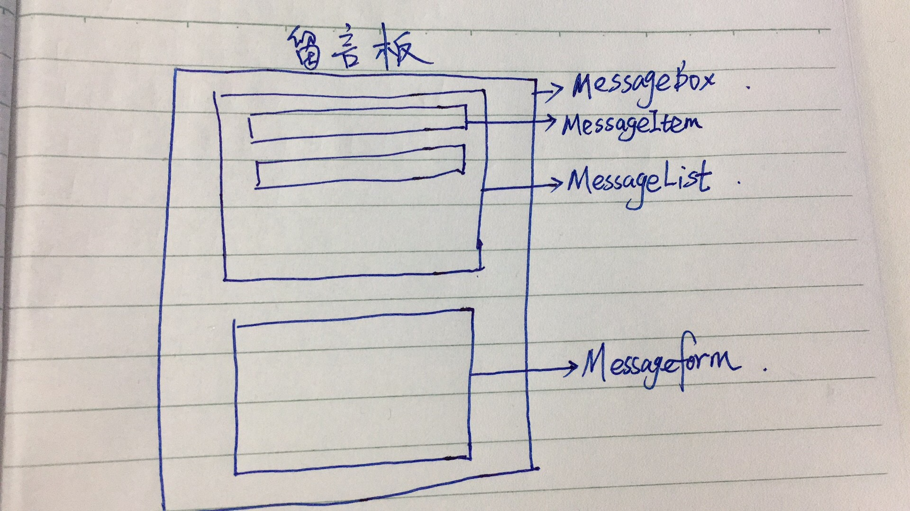

### 结构分析
1. 图解

### 代码结构分析
1. 在src中建一个文件夹leave-box
2. 文件一：index.js   作用：一般整合文件，只需要渲染
3. 文件二：MessageBox.js  作用：根组件

### 数据存储
1. localStorageh中存
    - `localStorage.setItem("messages", JSON.stringify(messages))`
2. 在页面加载完 componentWillMount 中拿数据

